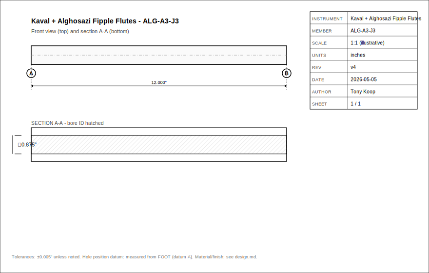
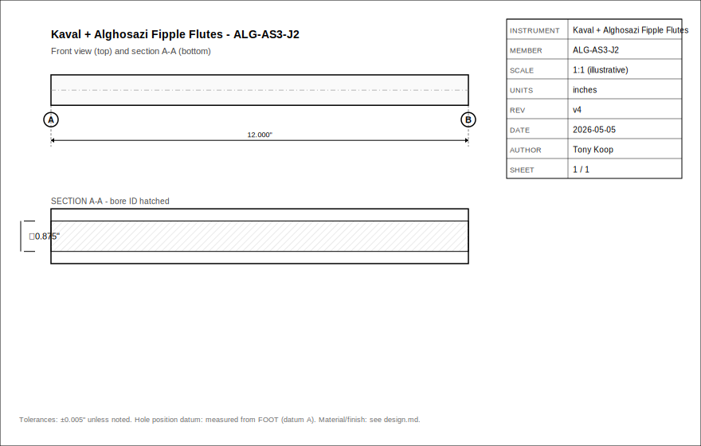
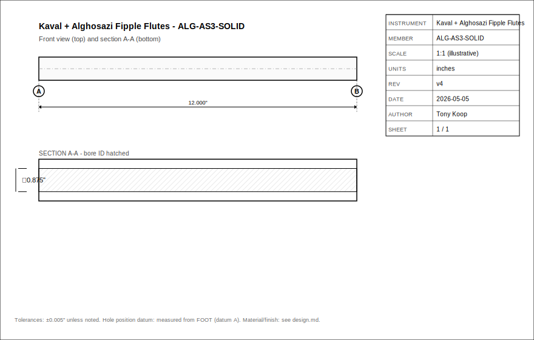
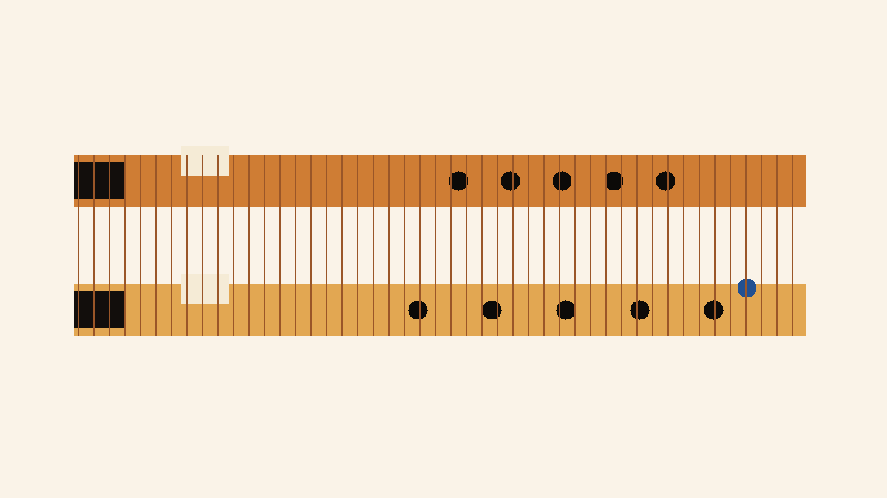

# Kaval + Alghosazi Fipple Flutes Capstone
- Musical instrument documentation capstone
- Build packet: kaval-alghosazi-flutes
- Generated: 2026-05-05

---

# Project Intent
- Design a buildable family of long fipple kavals and Alghosazi flutes that feel close to the Fujara Flutes references while using Tony's existing fujara/flute workshop logic: parametric dimensions, a controllable fipple sound-window head, split-blank CNC or deep-bore construction, validation tables, and documented tuning loops.

_Speaker notes:_ Read design.md before committing to dimensions or sourcing decisions.

---

# Physics Model
- These flutes are modeled as **open-open cylindrical fipple flutes** with a non-NAF fujara-style sound-window end correction.

```
f = c / (2 * L_eff)
c = 13552 in/s at about 68 F
L_eff = physical_labium_to_foot + foot_end_correction + sound_window_correction
foot_end_correction ~= 0.6 * bore_radius
sound_window_correction = measured prototype value, not Tony's NAF K2 table
```

```
x_from_labium = labium_to_foot * 2^(-semitone_offset / 12)
x_from_foot = labium_to_foot - x_from_labium
```

_Speaker notes:_ Governing equations extracted verbatim from design.md. Apply empirical corrections (NAF K2, scale offsets) only where the model permits — see references/acoustic-models.md.

---

# How To Use This Packet
- Start with design.md for intent and assumptions.
- Use bom.csv, sourcing.csv, and cut-list.csv before buying or cutting.
- Use drawing-brief.md and CAD/CNC folders before machining.
- Print the packet for shopping, shop work, and validation.

---

# File Map
- design.md: Project intent, catalog metadata, assumptions, and validation plan.
- bom.csv: Starter bill of materials with part categories, quantities, drawing refs, and notes.
- sourcing.csv: Supplier/search tracker with specs, price/date fields, lead time, substitutes, and risks.
- cut-list.csv: Rough/final stock sizes, material, grain/orientation, operations, yield, and offcuts.
- drawing-brief.md: Manufacturing drawing and technical product sketch brief.
- assembly-manual.md: Shop-facing sequence, tools, fixtures, safety, tuning, finishing, and maintenance notes.
- validation.csv: Target/measured values, tolerance, environment, result, and tuning/build action log.
- supplier-rfq.md: Supplier email/request-for-quote starter.

---

# Family Spec

| member_id | instrument | subtype | target_note | target_hz | midi | scale_label | hole_count | hole_offsets_st | bore_id_in | body_od_in | wall_in | total_length_cm | total_length_in | top_to_window_in | labium_to_foot_in | open_pipe_leff_in | estimated_sound_window_correction_in | tuning_delta_interpretation | chamber_to_bore | wood_species | construction | source_basis | done_bar_ref | notes |
| --- | --- | --- | --- | --- | --- | --- | --- | --- | --- | --- | --- | --- | --- | --- | --- | --- | --- | --- | --- | --- | --- | --- | --- | --- |
| KAV-GS3-5H | Fipple Kaval | 5-hole Moldavian/Romanian | G#3 | 207.652 | 56 | Kaval gypsy mode: 0,2,3,6,7,8 semitones | 5 | 2 3 6 7 8 | 0.8750 | 1.3750 | 0.2500 | 79.0 | 31.102 | 1.600 | 29.502 | 32.631 | 3.129 | positive: needs fipple/window end correction or added acoustic length | 33.7 | Locust or elder | solid or split blank; optional two-piece joint | Fujara Flutes observed G# kaval length 79 cm | fujara + flutes + pistalka | Longest 5-hole starter; use as low-voice reference. |
| KAV-A3-5H | Fipple Kaval | 5-hole Moldavian/Romanian | A3 | 220.000 | 57 | Kaval gypsy mode: 0,2,3,6,7,8 semitones | 5 | 2 3 6 7 8 | 0.8750 | 1.3750 | 0.2500 | 74.0 | 29.134 | 1.600 | 27.534 | 30.800 | 3.266 | positive: needs fipple/window end correction or added acoustic length | 31.5 | Elder | two-piece optional hand-cut joint | Fujara Flutes observed A kaval length 74 cm | fujara + flutes + pistalka | Recommended first kaval because length, bore, and hand span are forgiving. |
| KAV-B3-5H | Fipple Kaval | 5-hole Moldavian/Romanian | B3 | 246.942 | 59 | Kaval gypsy mode: 0,2,3,6,7,8 semitones | 5 | 2 3 6 7 8 | 0.8125 | 1.3125 | 0.2500 | 67.0 | 26.378 | 1.500 | 24.878 | 27.440 | 2.562 | positive: needs fipple/window end correction or added acoustic length | 30.6 | Elder | solid split blank | Fujara Flutes observed B kaval length 67 cm | fujara + flutes + pistalka | Compact 5-hole version; tighter fipple tolerances. |
| KAV-C4-5H | Fipple Kaval | 5-hole Moldavian/Romanian | C4 | 261.626 | 60 | Kaval gypsy mode: 0,2,3,6,7,8 semitones | 5 | 2 3 6 7 8 | 0.7500 | 1.2500 | 0.2500 | 62.0 | 24.409 | 1.450 | 22.959 | 25.900 | 2.940 | positive: needs fipple/window end correction or added acoustic length | 30.6 | Elder, maple, or cherry | solid split blank | Fujara Flutes observed C kaval length 62 cm | fujara + flutes + pistalka | Smallest 5-hole kaval; good for fipple/head trials. |
| KAV-A3-7H | Fipple Kaval | 7-hole expanded Moldavian | A3 | 220.000 | 57 | Expanded kaval: 0,2,3,4,6,7,8,9 semitones | 7 | 2 3 4 6 7 8 9 | 0.8750 | 1.4000 | 0.2625 | 90.0 | 35.433 | 1.650 | 33.783 | 30.800 | -2.983 | negative: observed source length is overlong for this nominal root; trim foot or reassess key naming | 38.6 | Elder | solid split blank | Fujara Flutes observed 7-hole A kaval length 90 cm | fujara + flutes + pistalka | Expanded note set; lower holes may be covered with finger bases. |
| KAV-AS3-7H | Fipple Kaval | 7-hole expanded Moldavian | A#3 | 233.082 | 58 | Expanded kaval: 0,2,3,4,6,7,8,9 semitones | 7 | 2 3 4 6 7 8 9 | 0.8750 | 1.4000 | 0.2625 | 85.0 | 33.465 | 1.650 | 31.815 | 29.071 | -2.743 | negative: observed source length is overlong for this nominal root; trim foot or reassess key naming | 36.4 | Dogwood or elder | two-piece optional hand-cut joint | Fujara Flutes observed 7-hole A# kaval length 85 cm | fujara + flutes + pistalka | Good two-piece test because the published example is collapsible. |
| KAV-B3-7H | Fipple Kaval | 7-hole expanded Moldavian | B3 | 246.942 | 59 | Expanded kaval: 0,2,3,4,6,7,8,9 semitones | 7 | 2 3 4 6 7 8 9 | 0.8125 | 1.3125 | 0.2500 | 69.0 | 27.165 | 1.500 | 25.665 | 27.440 | 1.774 | positive: needs fipple/window end correction or added acoustic length | 31.6 | Elder | solid split blank | Fujara Flutes observed 7-hole B kaval length 69 cm | fujara + flutes + pistalka | Compact 7-hole version; validate hand position before final hole diameters. |
| ALG-AS3-J2 | Fipple Alghosazi | Anasazi-derived with thumb hole | A#3 | 233.082 | 58 | Anasazi-derived: 0,2,4,7,9,11,12 semitones | 6 | 2 4 7 9 11 12 | 0.8750 | 1.3750 | 0.2500 | 82.0 | 32.283 | 1.800 | 30.483 | 29.071 | -1.412 | negative: observed source length is overlong for this nominal root; trim foot or reassess key naming | 34.8 | Ash | two-piece hand-cut joint | Fujara Flutes observed A# Alghosazi length 82 cm | fujara + flutes + pistalka | Recommended first Alghosazi; published example uses a collapsible joint. |
| ALG-AS3-SOLID | Fipple Alghosazi | Anasazi-derived with thumb hole | A#3 | 233.082 | 58 | Anasazi-derived: 0,2,4,7,9,11,12 semitones | 6 | 2 4 7 9 11 12 | 0.8750 | 1.3750 | 0.2500 | 85.0 | 33.465 | 1.800 | 31.665 | 29.071 | -2.593 | negative: observed source length is overlong for this nominal root; trim foot or reassess key naming | 36.2 | Locust | solid split blank | Fujara Flutes observed solid A# Alghosazi length 85 cm | fujara + flutes + pistalka | Solid-body alternate for comparing joint vs no-joint response. |
| ALG-A3-J3 | Fipple Alghosazi | Anasazi-derived with thumb hole | A3 | 220.000 | 57 | Anasazi-derived: 0,2,4,7,9,11,12 semitones | 6 | 2 4 7 9 11 12 | 0.8750 | 1.3750 | 0.2500 | 73.0 | 28.740 | 1.750 | 26.990 | 30.800 | 3.810 | positive: needs fipple/window end correction or added acoustic length | 30.8 | Oak | three-piece hand-cut joint | Fujara Flutes observed A Alghosazi length 73 cm | fujara + flutes + pistalka | Use as the modular joint stress test. |
| ALG-B3-SOLID | Fipple Alghosazi | Anasazi-derived with thumb hole | B3 | 246.942 | 59 | Anasazi-derived: 0,2,4,7,9,11,12 semitones | 6 | 2 4 7 9 11 12 | 0.8125 | 1.3125 | 0.2500 | 70.0 | 27.559 | 1.650 | 25.909 | 27.440 | 1.531 | positive: needs fipple/window end correction or added acoustic length | 31.9 | Elder or maple | solid split blank | Fujara Flutes observed B Alghosazi length 70 cm | fujara + flutes + pistalka | Compact Alghosazi; top thumb hole needs ergonomic mockup. |

_Speaker notes:_ Sizes scale via the master scale factor; tuning targets are first-order Helmholtz/cantilever predictions to be empirically corrected per prototype.

---

# Build Workflow
- Design and assumptions
- Source materials and hardware
- Prepare stock, fixtures, and CNC/laser/lathe setup
- Assemble, tune, finish, and validate

---

# Sourcing And BOM
- BOM gives part categories and drawing references.
- Sourcing tracks search terms, supplier candidates, price/date, lead time, substitutions.
- Visual BOM brief turns the parts list into a presentation-ready image board.

---

# Shop Packet
- Cut list for lumber/sheet/blank planning.
- Assembly manual for away-from-keyboard work.
- Validation sheet for measured dimensions, tuning, pass/fail checks.

---

# Drawings, CAD, CNC
- drawing-brief.md defines required views, dimensions, datums, sketch intent.
- cad/ holds models and design tables.
- cnc/ holds CAM, toolpaths, setup sheets, dry-run notes.
- drawings/ holds PDFs, SVGs, DXFs, drawing exports.






---

# Images And Screenshots
- images/hero.png



---

# Validation Plan
- A4 = 440 Hz reference check.
- Tuning targets logged in validation.csv.
- Critical dimensions verified against design sheet and CAD.
- Photos and revision notes after each major step.

---

# Open Risks / Decisions
- TBDs in design sheet and BOM.
- Supplier price/availability not yet verified.
- Generated images marked as concept placeholders.
- Empirical corrections await measured prototype data.

---

# Next Actions
- Replace TBDs with measured/source-backed values.
- Verify live supplier price and availability before buying.
- Export final drawings and visual BOM images.
- Regenerate this deck and print packet after final edits.

---
